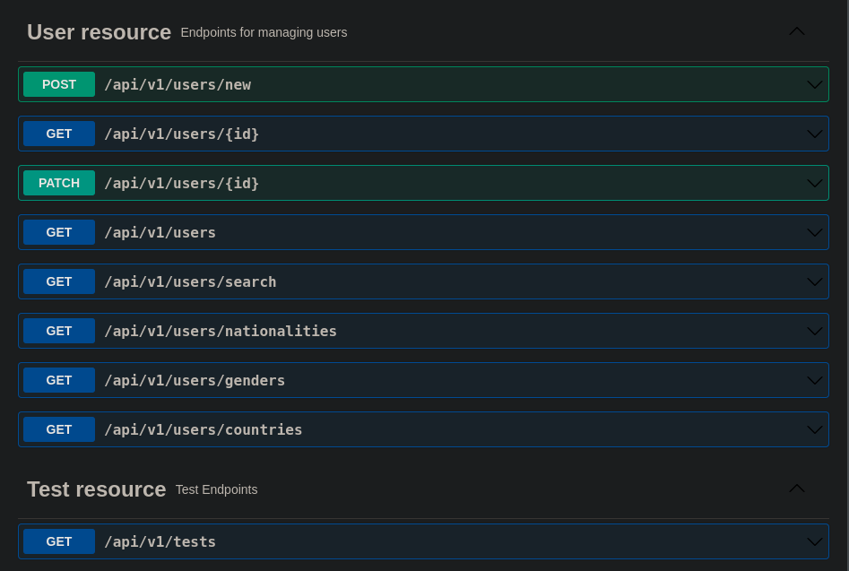
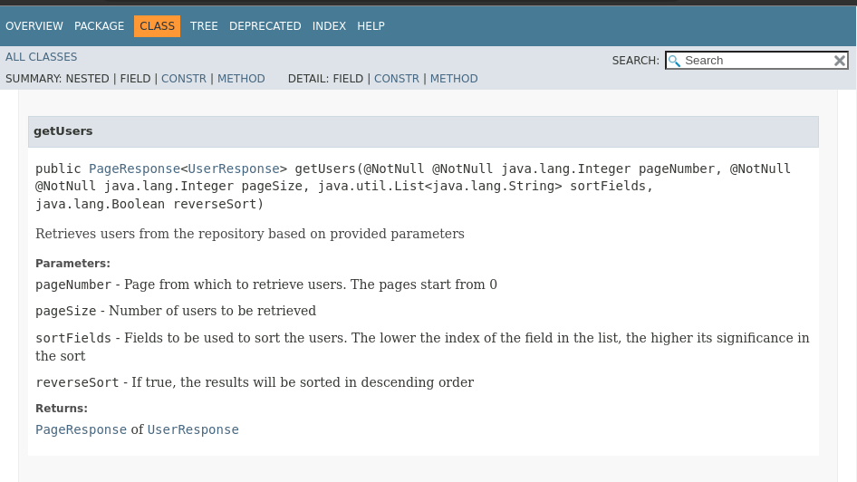
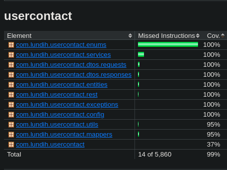

# User Contact

CI status: <br>
[](https://circleci.com/gh/lundih/user-contact)

## Introduction

This project is a Spring Boot backend application that is intended to provide an API for a user contact 
page that allows for displaying and manipulating of basic user information.

The application allows for the following actions on users:
 - creating
 - editing 
 - fetching (with sort)
 - searching

The project uses a PostgreSQL database (with the name as **contacts**).

## Running the project

Java 11 is required. This version of Java was chosen as it is (at the time of making the choice) the most
used version of Java.
<br><br>
To run the project, use the command 
```
./gradlew bootRun 
```
To build the jar file:
```
./gradlew build
```

## Documentation
### API documentation

API documentation (Swagger) can be found by running the project then navigating to 
[API documentation](http://localhost:10001/swagger-ui/index.html#/). The documentation will show available 
endpoints and the schemas of the requests and responses. It is also possible to make requests and receive
responses from the page.


### Code documentation 

To generate code documentation in HTML, use the command
```
./gradlew javadoc
```
The documentation will be found under the path *build/docs/javadoc/`index.html`*


## Testing

To run tests, use the command
```
./gradlew check
```
This will run tests, generate reports, and check test coverage (using jacoco). This will exit with an error if the test 
coverage is below a specified minimum. 


 - JUnit test reports will be found under the path *build/reports/junit/`index.html`*.
 - Jacoco test reports will be found under the path *build/reports/jacoco/`index.html`*.

## CI/CD
CircleCI will run tests and build the project as part of continuous integration. The `build-docker.sh` script can be used
to build a docker image by running
```
./build-docker.sh
```
and then providing the requested arguments. If the script does not run because of permissions, attempt to fix that using
the command 
```
chmod +x build-docker.sh
```

## Recommendations

 - Implement strong authentication for use in production.
 - Implement authorisation to allow only authorised users access to certain endpoints.
 - For complex projects, use dependency inversion. The principle dictates that higher level components should not 
directly depend on lower level components. Instead, they should depend on the abstractions of those lower level 
components. This will make it easier to swap out implementations.
 - It is possible to use multiple profiles to make it easier to switch between different implementations of the project.
e.g. to only show the API docs when running in dev mode and not in production, or to show different log levels, or to
use different database credentials, or to implement different CI/CD processes depending on the profile being used.
 - Use database migration tools to help set up the database.
 - Implement monitoring and alerts to keep up with the status of the application in production.
